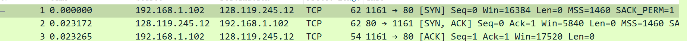
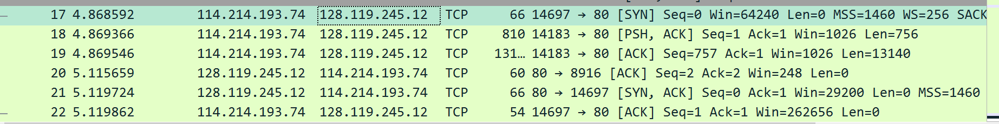
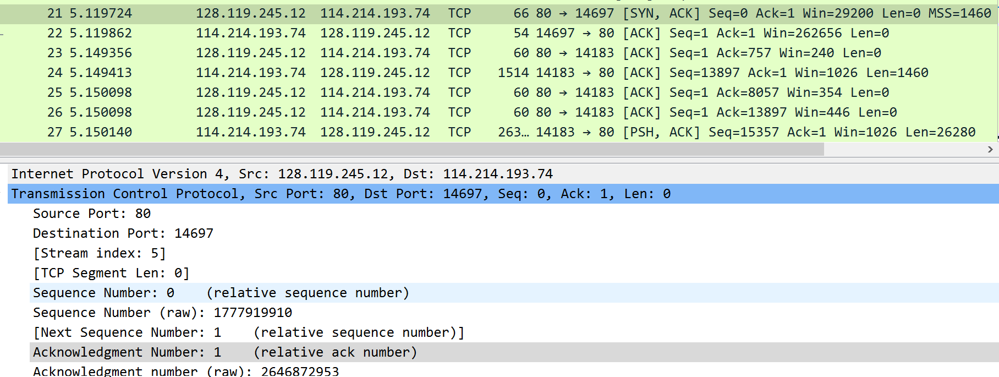
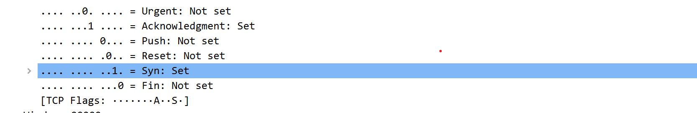
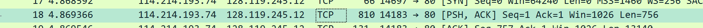
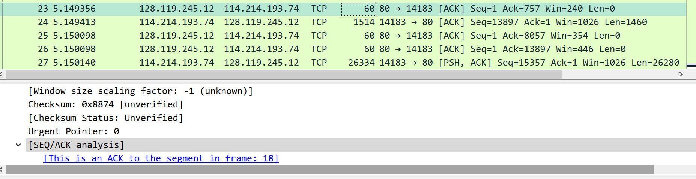
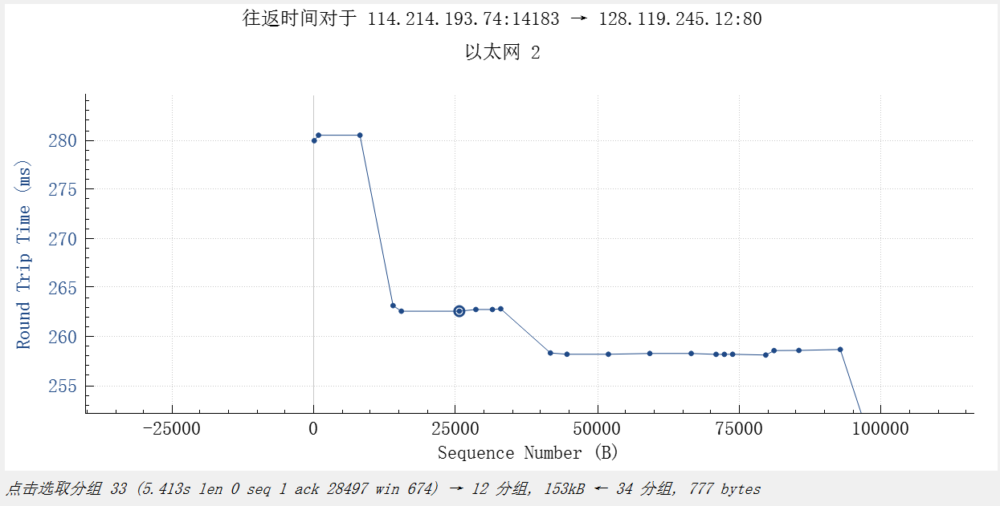
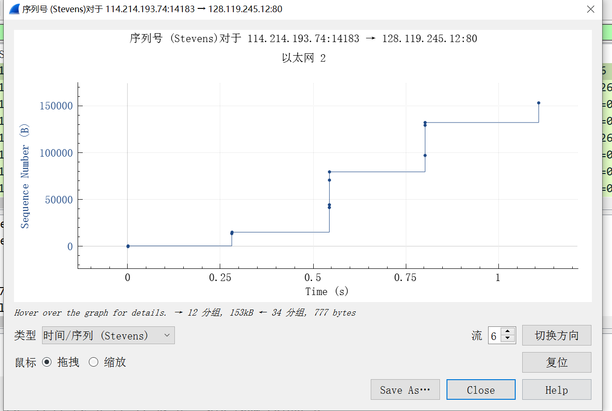
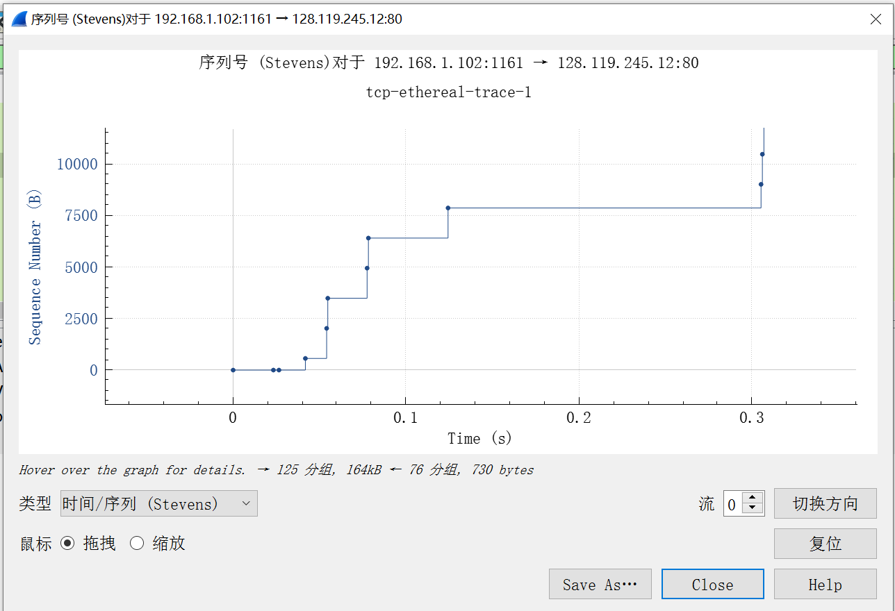

#### 实验五

##### Wireshark Lab: TCP

---

阅读实验文档，按照要求进行实验。

1.首先要使用wireshark获取从计算机到服务器的TCP包。按照操作进行。先从[网站](http://gaia.cs.umass.edu/wireshark-
labs/alice.txt)下载一个 ASCII文件，然后登陆http://gaia.cs.umass.edu/wireshark-labs/TCP-wireshark-file1.html上传这个文件，并使用wireshark进行抓包。

2.按照实验说明操作，先用TCP筛选，找到和gaia.cs.umass.edu的一系列信息，包括包含SYN的三次握手，HTTP POST消息，TCP segment of a reassembled PDU等。回答文档中的问题：

1，2是分析下载的抓包结果

1. 

   源IP 192.168.1.102；端口号 1161

2. 从上图可以看出，网站IP 128.119.245.12，端口 80

3. 按操作更改设置，取消勾选http；

   

   自己的抓包IP 114.214.193.74，端口 14697

3.**TCP Basics**

回答一些关于TCP段的问题

4. 可以从第3题的图中看出，Seq=0，识别是为了开始三次握手，这是第一次。

5. 

   

   回应的Seq=0，Acknowledgment值为1，Ack可以表明确认字段的值是有效的，说明服务器收到了发送请求，回复SYN-ACK确认报文。

6. 

   seq=1

7. 

   

   

   第一段：len=756，序列号1，RTT=0.27999s

   EstimatedRTT=RTT=0.27999s

   剩下的同理，

   第二段：len=13140，seq=757，RTT=0.280552s

   $EstimatedRTT=0.875*0.27999+0.125*0.280552=0.28006025s$

   第三段：len=1460，seq=13897，RTT=0.263173s

   $EstimatedRTT=0.875*0.28006025+0.125*0.263173=0.27794934s$

   第四段：len=26280，seq=15357，RTT=0.262849s

   $EstimatedRTT=0.875*0.27794934+0.125*0.262849=0.27606180s$

   第五段：len=2920，seq=41637，RTT=0.258209s

   $EstimatedRTT=0.875*0.27606180+0.125*0.258209=0.27383020s$

   第六段：len=8760，seq=44557，RTT=0.258292s

   $EstimatedRTT=0.875*0.27383020+0.125*0.258292=0.271888s$

8. 长度分别是810，13194，1514，26334，2974，8814

9. 最小的缓冲区Win=1026，是第一次ACK返回时的值。后面的值都比1026大，所以缓存空间的缺失不会限制发送。

10. 

    由图可以看出，序列号时递增的，应该是没有重传。

11. 两次传输之间seq的差值，这个差值就是在前面的ACK中确认的数据

12. 可以由最后一个ACK的值减去最初的，除以时间差，就是吞吐量：$\frac{153078-1}{5.977683-4.869366}=138116.62$bytes/s

4.TCP拥塞控制

*由于我抓包获得的图像和理想的差距太大，不好分析，所以选择使用作者的抓包进行分析。*

13. 观察图像，慢启动从分组5到分组13，也即0.04174s到0.1242s；之后几乎停滞，进入了拥塞避免阶段。这个和课本上的区别：课本的比较理想化，是指数增长，但这个数据近似指数增长，但是数据拐角比较明显。
