#### 实验六

##### Wireshark Lab：IP

---

阅读实验文档：

1. 原理是利用traceroute来生成一系列的IP数据报。但是由于win10系统的程序不允许更改ICMP echo请求，所以最终是用pingplotter来实现。

   然后按照操作执行：

   * 打开Wireshark，直接抓包。
   * 启动pingplotter，输入追踪的目标名称和追踪次数，进行追踪。

   效果如下：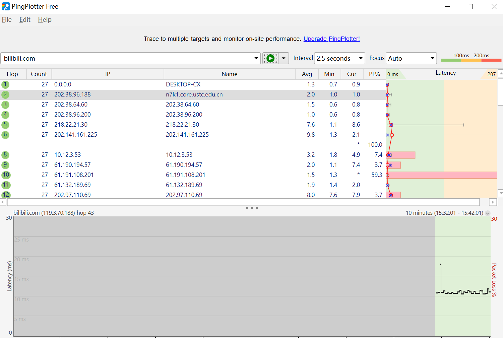

   * 发送一组长度2000的数据报
   * 发送长度3500的数据报，停止Wireshark捕捉

   *由于个人抓包干扰较多，不好分析，所以直接使用作者提供的包进行分析。*

1. 对捕获的数据包进行分析，并回答问题。

   1.  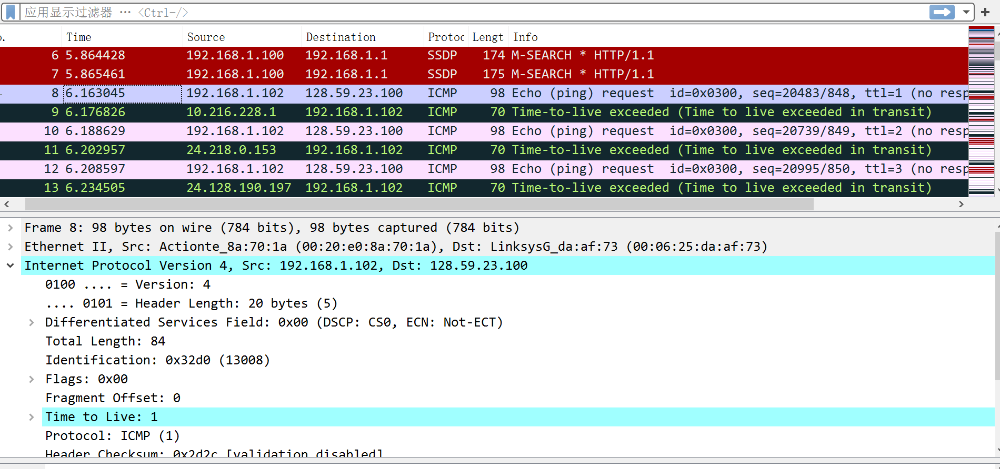

      这是第一个ICMP echo请求，自己的IP地址是192.168.1.102

   1. 从上图的Protocol: ICMP(1)看出，上层协议字段是1

   1.  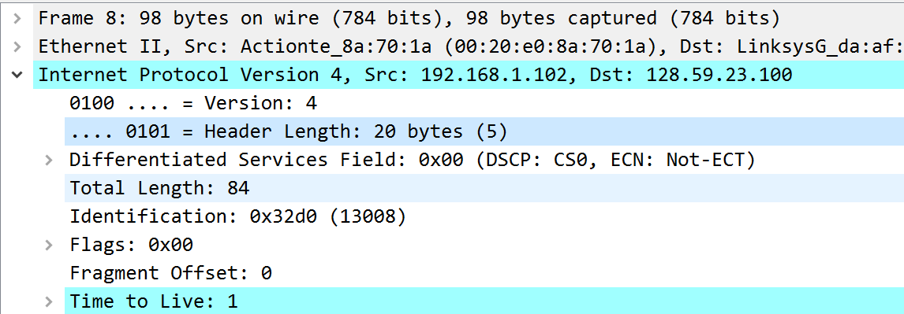

      根据Header Length: 20 bytes，Total Length: 84可以看出IP首部是20字节，数据报的负载是$84-20=64$字节

   1.  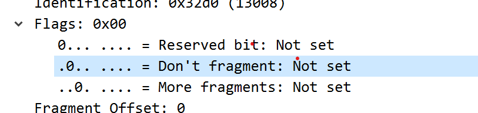

      从图中可以判断是没有分段的

   1. 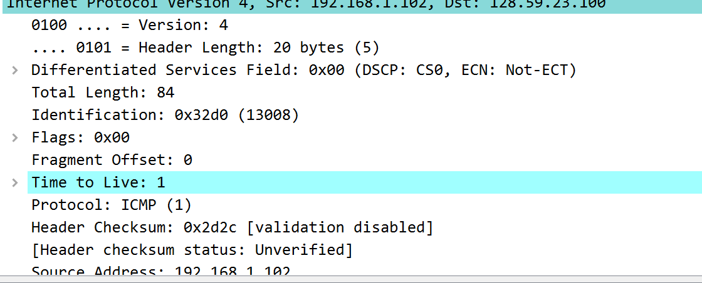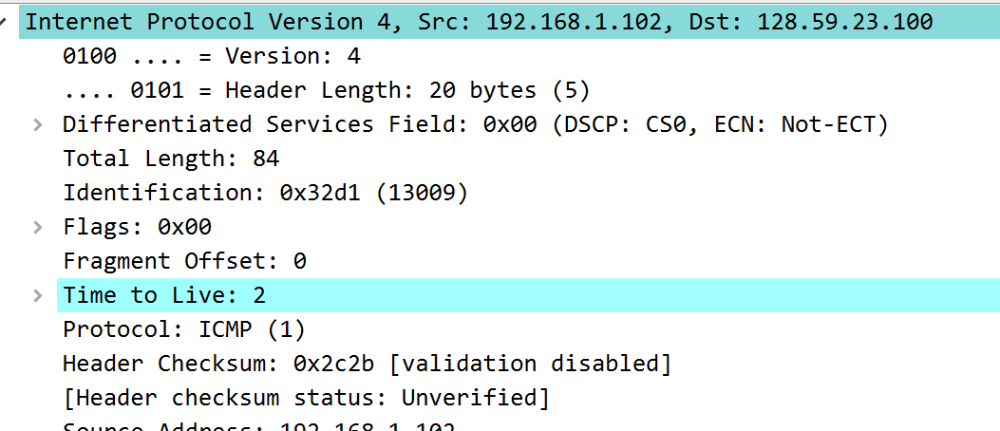

      观察信息可得，Identification，Time to Live，Header Checksum都是变化的

   1. 结合IPv4报文结构看

      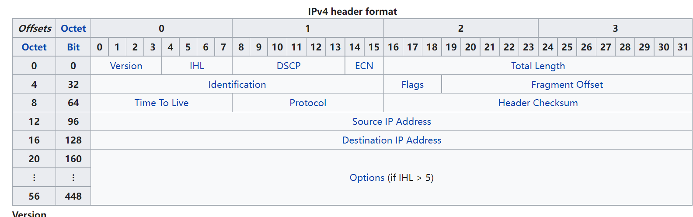

      固定不变的：Header Length, Flags, Fragment Offset, Total Length, Source Address, Destination Address, ECN, Version, IHL, DSCP, Protocol 

      必须不变的：Version, IHL, DSCP, Protocol

      必须改变的：Time to Live, Identification, Header Checksum, 

   1. Identification: 0x32d0 (13008), Identification: 0x32d1 (13009), Identification: 0x32d2 (13010)

      在抓包中，这部分的值是递增的，用来区分每一个到达的IP数据报

   1. 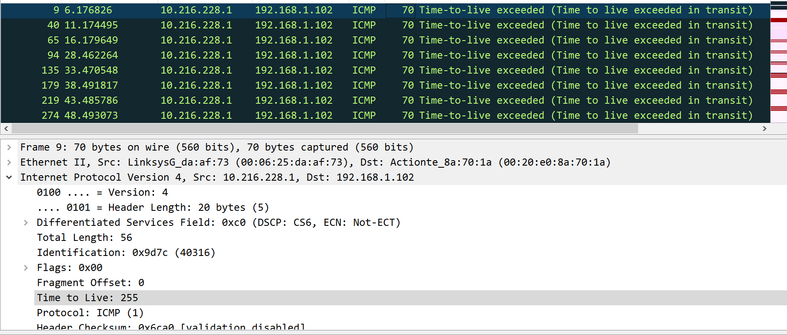

      最近的超时的值：Identification: 0x9d7c (40316)， Time to Live: 255

   1. 观察到，这些值Identification改变，但是TTL不变

3. 用时间分组

   10. 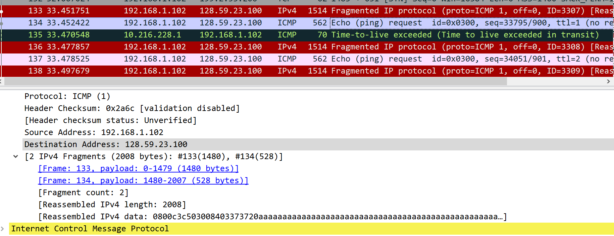

       从图中可以看出，已经分为两段了

   10.  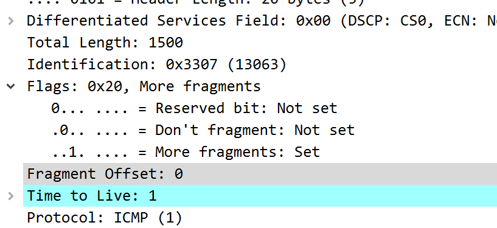

       从图中看出More fagments: set判断分段，Fragment Offset: 0说明是第一个分段，长度是1500

   10.  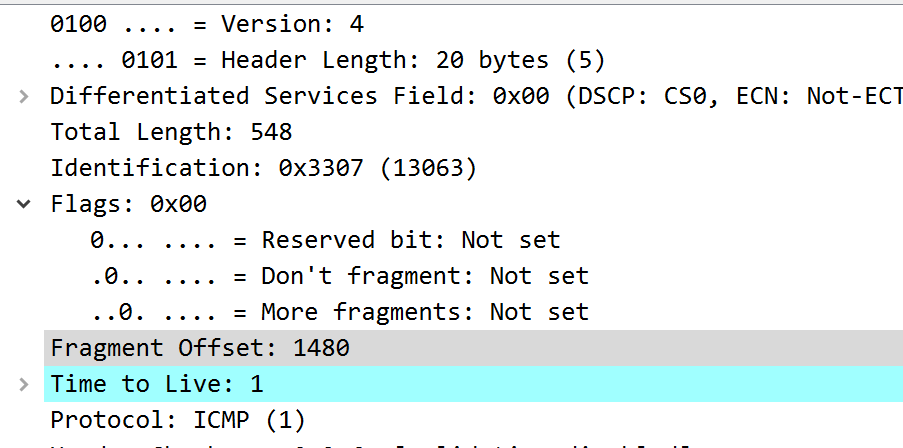

       图中偏移量1480，接上一个分片(报头20字节，所以是1480)，More fragments: Not set表示这是最后一个，后面没有了

   10. 观察两者，发现Identification, Flags, Header Checksum是改变的

   10. 3500的其实和2000基本同理，如图：

       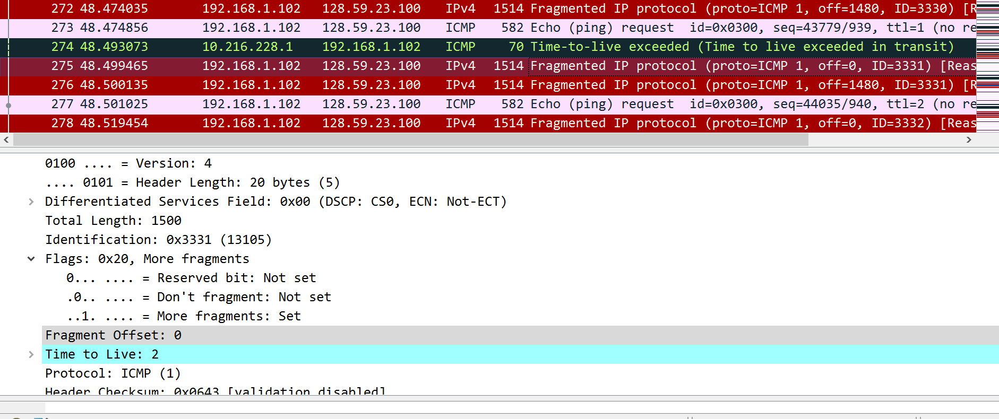

       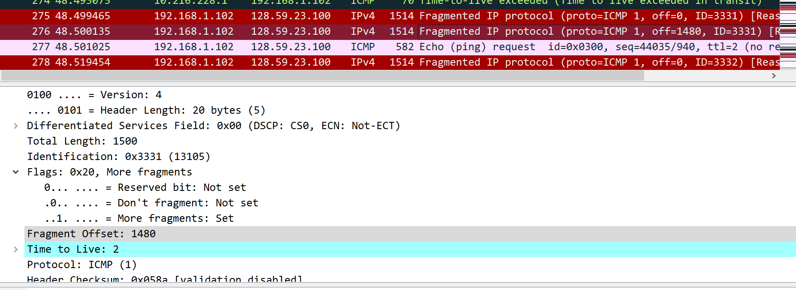

       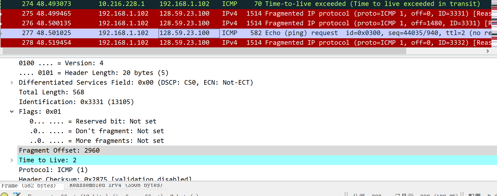

       分成了三段

   10. 变化其实和上面一样，都是Identification, Flags, Header Checksum这三个发生改变