#### 实验七

##### Wireshark Lab：Ethernet and ARP

---

阅读实验文档：

1. 按照操作进行抓包。

   * 首先清除浏览器缓存。

   * 打开wireshark准备抓包，进入文档给出的网站http://gaia.cs.umass.edu/wireshark-labs/HTTP-ethereal-lab-file3.html，加载完毕后停止抓包。

   * 在其中找到HTTP GET消息以及 gaia.cs.umass.edu发送的HTTP响应。按照操作尝试后总是找不到想要的信息，所以直接选择文档给出的包进行分析。

   * 打开wireshark的设置，在显示捕获的包窗口，选择只显示IP协议以下的信息。

     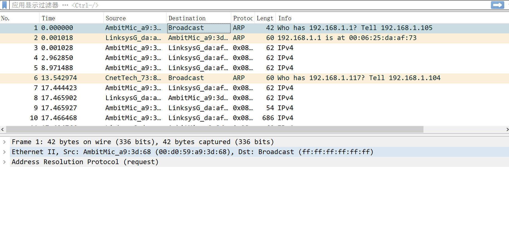

   * 选择包含HTTP GET信息的帧，展开详细信息并进行分析，然后回答下面的问题。

   1. 如图：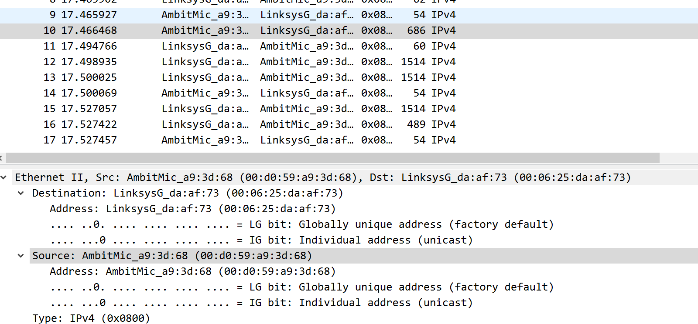

      48位地址为：Address：AmbitMic_a9:3d:68(00:d0:59:a9:3d:68)

   1. 由上图知，目的地址的48为地址为：Address：LinksysG_da:af:73(00:06:25:da:af:73)，这个不是gaia.cs.umass.edu的地址，这个应该是对应的子网的路由器的地址

   1. 还是由上图看出，是0x0800，对应的上层协议是IPv4

   1. 如图：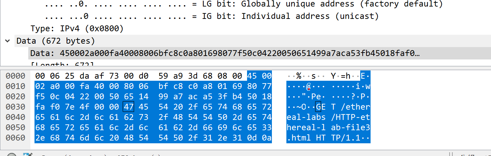

      根据Data的内容看出，在G之前$16*3+6=54$个字节

   * 找到第一个HTTP响应部分，分析并回答问题。

   5. 如图：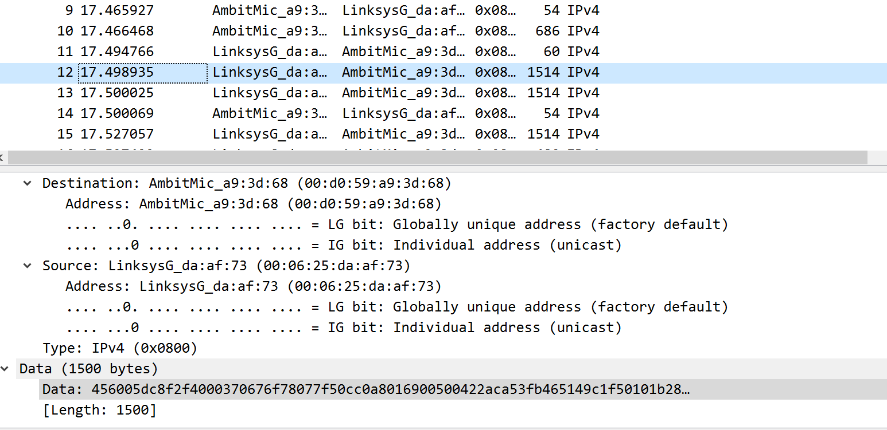

      源地址：Address: LinksysG_da:af:73 (00:06:25:da:af:73)，同第2问，这个是对应的路由器的地址

   5. 目的地址：Address: AmbitMic_a9:3d:68 (00:d0:59:a9:3d:68)，这个是我电脑的以太网的地址

   5. 类似的，是0x0800，是IPv4协议

   5. 如图：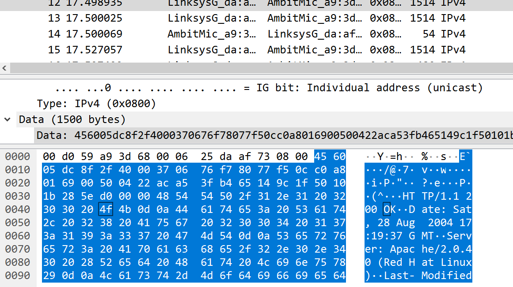

      根据Data看出，O之前有$16*4+3=67$字节

1. 阅读实验文档，学习ARP协议。

   * 打开win10的cmd，输入arp指令，如图：

      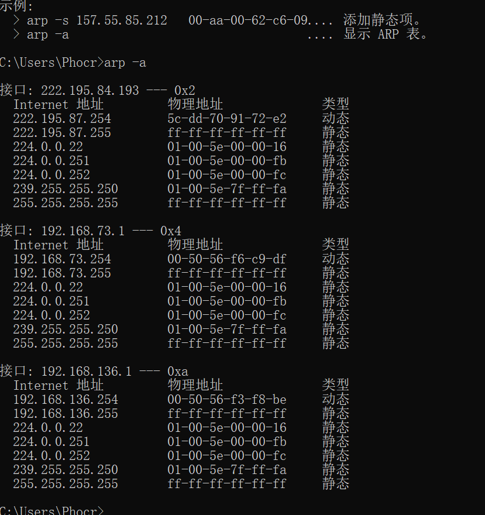

   9. 内容如上图所示，含义：第一列IP，第二列MAC地址，第三列为类型

   * 清除arp缓存和浏览器缓存。
   * 打开wireshark，打开网站http://gaia.cs.umass.edu/wireshark-labs/HTTP-wireshark-lab-file3.html进行抓包。
   * 同上面的操作，去除IPv4以上的协议的影响。但是由于自己抓包干扰太大，总是找不到，所以选择文档提供的包进行分析，并回答问题。

   10. 如图：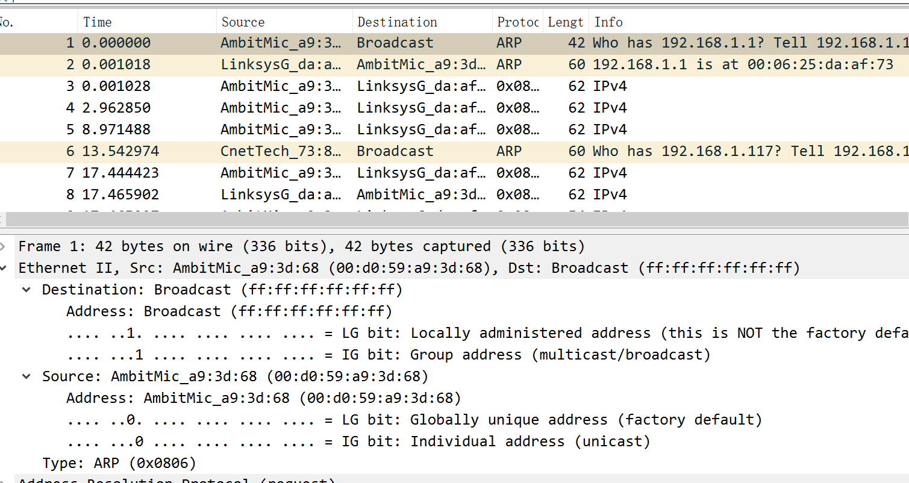

       目的地址：Address: Broadcast (ff:ff:ff:ff:ff:ff)

       源地址：Address: AmbitMic_a9:3d:68 (00:d0:59:a9:3d:68)

   10. 由上图，协议十六进制值是0x0806，ARP

   10. a）如图：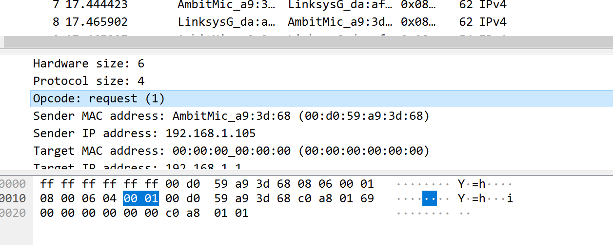

       是20个字节

       b）由上图看出，opcode值为1

       c）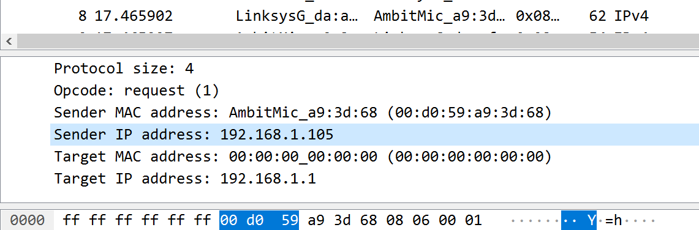

       包含IP地址，是192.168.1.105

       d）根据Target IP address: 192.168.1.1看出

   10. 如图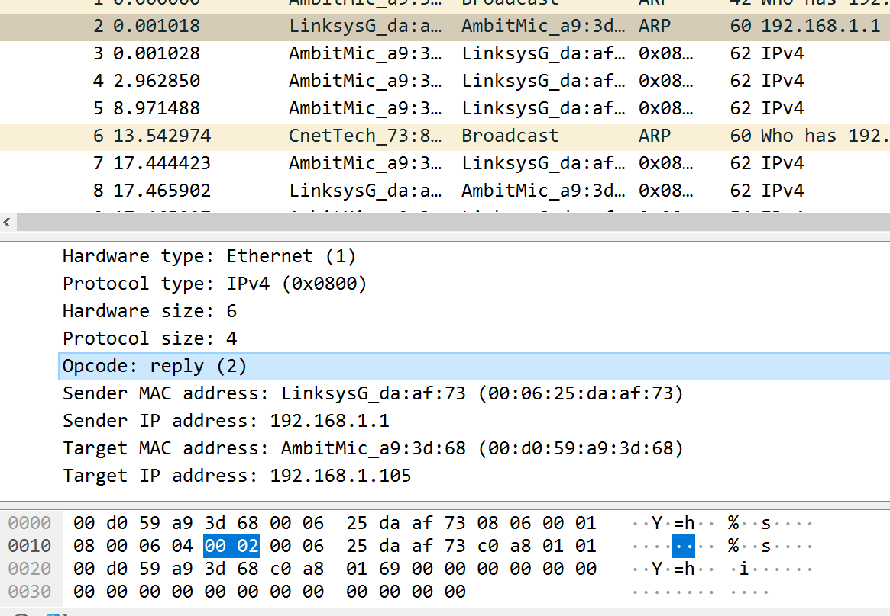

       a）opcode之前是20字节

       b）opcode：reply(2)，值为2

       c）应该是Sender IP address: 192.168.1.1

   10. 如图：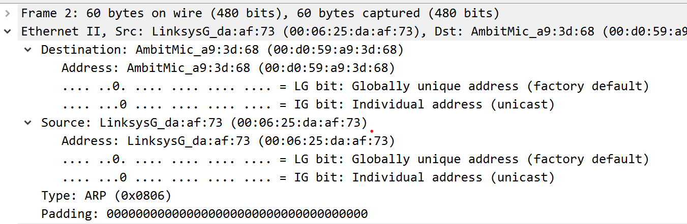

       目的地址：Destination: AmbitMic_a9:3d:68 (00:d0:59:a9:3d:68)

       源地址：Source: LinksysG_da:af:73 (00:06:25:da:af:73)

   10. 因为ARP查询是以广播方式发送请求报文，但是响应报文是以单播形式发送的